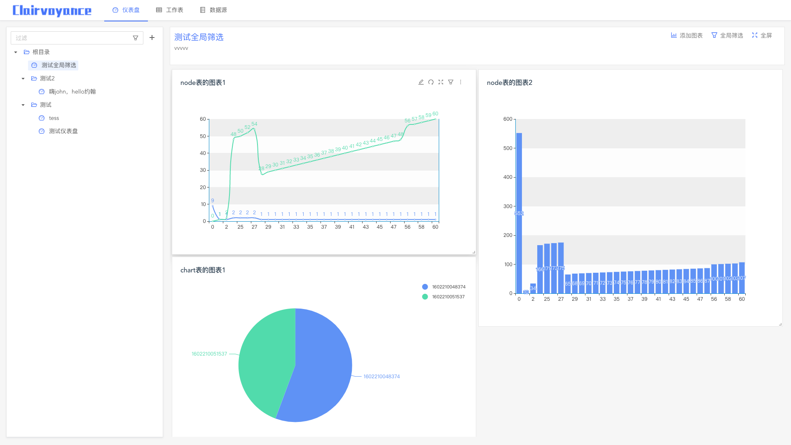
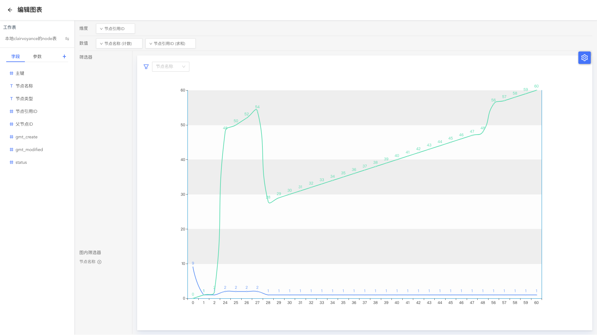
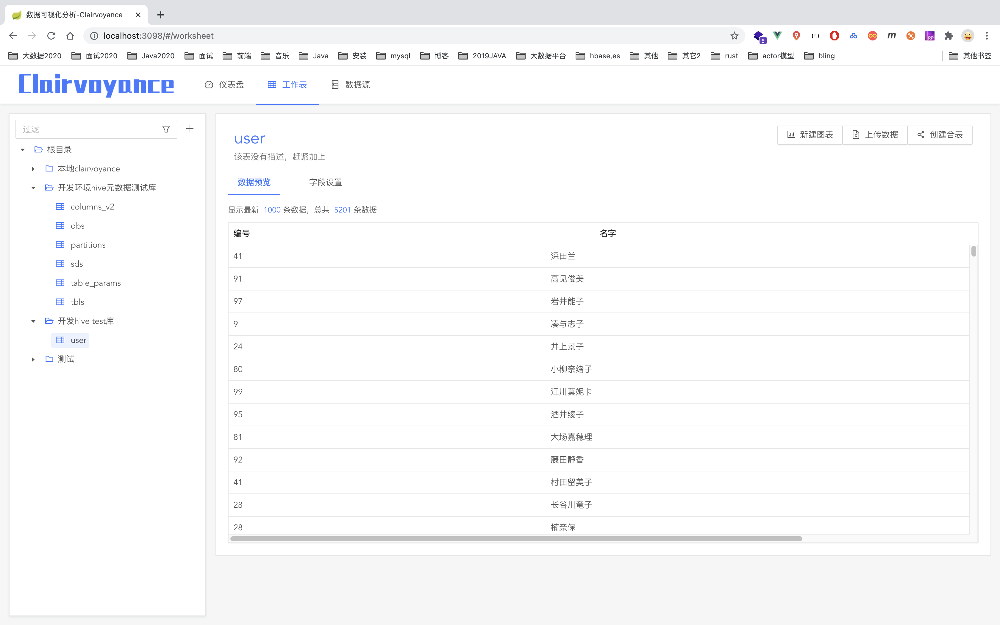

# 数据可视化分析工具 - Clairvoyance

 **Clairvoyance**

> **clairvoyance**  美 *[kler'vɔɪəns]* 	英 *[kleə'vɔɪəns]* 

- 支持图表类型：折线图、柱状、指标卡、计量图、条形图、饼图（只是初步绘制没有参数设置）
- 数据源支持presto、mysql
- 基础支持分组、聚合、排序、筛选器、图内筛选器
- 高级支持自定义字段（分组、计算）、钻取、全局筛选、多表联动

> 前端部分很久没更新了
>
> 考虑到前端配置/交互部分工作量巨大。
>
> 准备等vue3稳定了再开发并重构前端
>
> 顺便把没完成的功能补上。
>

## 预览
### 仪表盘预览

### 图表编辑预览

### 工作表预览

## TODO LIST 

### 数据源：
1. 上传数据(excel/csv)
2. 自定义view视图(比如关联表、聚合表等)

### 图表：
1. 图表间联动和全局筛选（前端部分）
2. 支持对比和次轴
3. 自由钻取分析
4. 自定义图表配置、样式（重点）
5. 告警

### 整体：
1. 用户体系
2. 安全/权限
3. 图表/数据下载
4. 分享
5. 集成

等等
