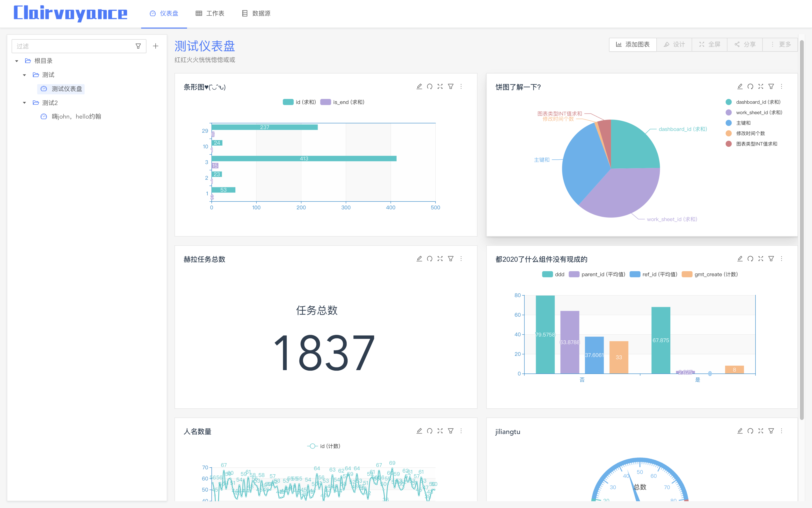
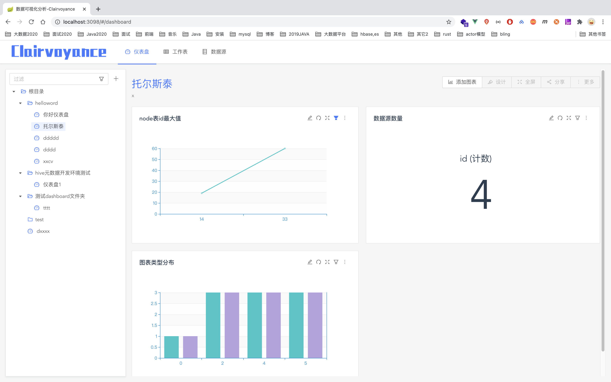
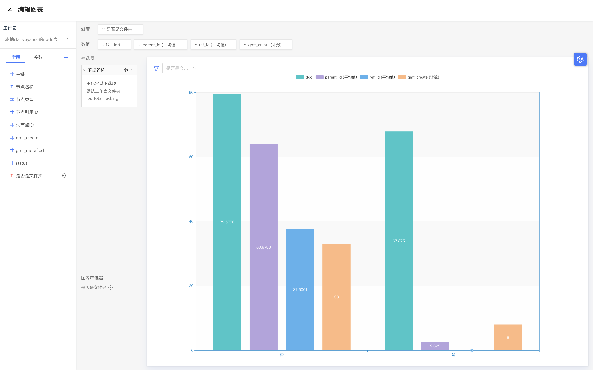
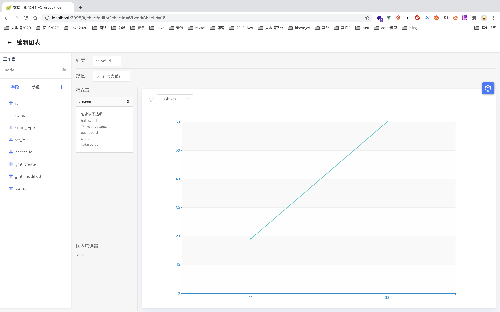

# 数据可视化工具 - Clairvoyance

 千里眼 **Clairvoyance**

> **clairvoyance**  美 *[kler'vɔɪəns]* 	英 *[kleə'vɔɪəns]* 

## 关于

~~开发一两天，所以只实现了最简单基础（数据源表等信息基于部分手动录入），只保证创建仪表盘、绘制图表等主流程走通。（2020.08.03）~~

主要模仿（抄袭）BDP的功能，我也是上周第一次用BDP，感觉比DaVinci好用一点

因为涉及到这块的开发，就顺便整体都开发一下，作为数据可视化工具起名为**Clairvoyance** 意为 **预知未来的能力** / **千里眼** / **异常的洞察力** ，虽然看起来有点长有点拗口，英文也不好念，不过中文翻译还是挺合适的。

目前整体的流程已经完全OK了，虽然图表只有6种类型，数据源也只有两种，不过后期完全可以边学习研究边扩展

暂时没有做用户体系、安全/权限、告警、图表/数据下载、分享、集成

## 数据源

~~目前直接配置在工作表中，后续单独维护（2020.08.03）~~
支持类型：mysql，presto（2020.08.09）

支持添加、测试连接、导入表

## 工作表

~~支持类型：mysql（2020.08.03）~~

后续hive，view（和表，比如关联表、聚合表等），上传数据，

~~目前手动维护在表中，后续可以读取数据库表信息直接同步数据表（2020.08.03）~~

由添加数据源中导入数据表， 暂不支持excel上传导入数据（2020.08.09）

【接口好了前端还没加的】

> 数据预览中过滤和选择显示字段等过滤数据功能
> 字段和表修改

## 仪表盘

可以创建仪表盘，新增图表

目前固定大小位置，不可拖动

暂时不支持图表间联动、全局筛选、下钻分析

## 图表

~~图表绘制字段使用的时候目前不是拖拽形式~~

支持图表类型：
折线图、柱状、指标卡、计量图、条形图、饼图
（不同数量值和维度的情况下没有做区分和限制，所以有些情况维度和数值数量不符合会导致图表的配置错误，会报错）

~~图表中只有简单的数据和图形，没有其他~~，简单加了legend……

支持选择维度（选择图表维度，可以设置字段名等）、数值（选择聚合函数）、筛选器（精确筛选、条件筛选、表达式）、图内筛选器
~~暂时不支持自定义字段（计算字段、分组字段）~~
可以添加自定义分组字段

暂不支持对比和次轴

## 效果预览

效果图如下，按照整体流程

从数据源（目前能导入表，但是界面丑）--> 数据表 --> 创建仪表盘 --> 添加图表 --> 配好图表返回即保存展示

### 仪表盘预览

### 图表编辑预览

### 工作表预览

## TODO LIST
除了一些CRUD以及前端的界面上的开发，目前还有涉及到好多必须需要做的大项功能：

### 数据源
1. 上传数据(excel/csv)
2. 自定义view视图(比如关联表、聚合表等)

### 图表
1. 支持对比和次轴
2. 图表间联动、全局筛选、下钻分析
3. 告警
4. 更多图表类型以及自定义图表配置（比如样式什么的）

### 整体
1. 用户体系
2. 安全/权限
3. 图表/数据下载
4. 分享
5. 集成

……

## 开发进度

0811
> 新增计量图、条形图、饼图（初步）

0810
> 分组字段功能（仅表达式）
> 前端创建分组字段未完成

0809

> 筛选器、图内筛选器功能实现

0808

> 拖拽方式增加维度/指标字段
>
> 编辑图表部分逻辑先放到vuex中 
>
> 修改部分样式
>
> 筛选器初步功能，
>
> fastjson改成jackson

0807

> presto sql 增加缓存
>
> 过滤器初步设计
>
> 增加数据库增删改方法（目前不一定用得到) 测试presto-jdbc，
>
> 测试presto的sourceDb和sourceTable的各个方法（从建表到查询） 
>
> 修改JdbcSourceTable表结构获取接口

0806

> 字段值集合接口
>
> 区分自定义字段 
>
> 分组字段等

0805	

> 数据源部分页面和测试数据源相关接口
>
> 图表编辑界面引入数据预览
>
> 工作表可以从数据源中添加
>
> 工作表数据预览
>
> 字段单独放到表中 
>
> 支持排序设置别名等

0803	

> 更新SQL执行逻辑

2020.08.03 	

> 完成制作图表主流程
